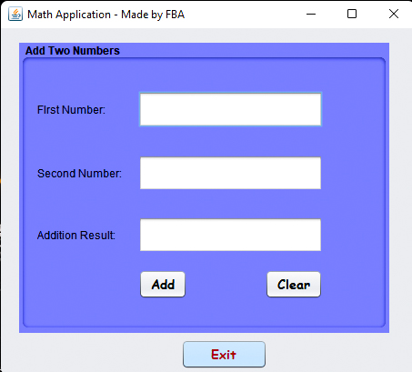
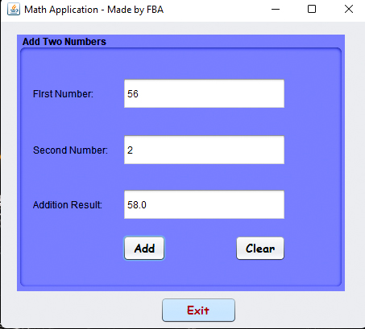
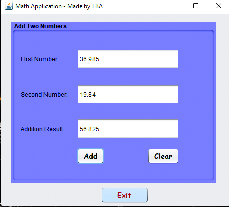

<h1 align="center"> MathApplication </h1>

# Output

The frontend of the application

Addition of two integers values

Addition of two float values

 

# Get the jar file!

[Download from here](Jar File/MathApplication.jar)
